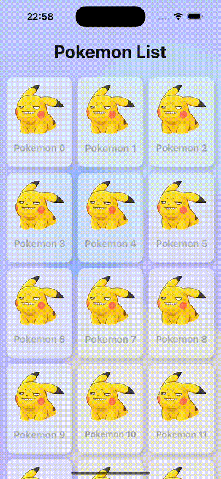

# SwiftUI RefreshableScrollView

RefreshableScrollView is a component that wraps SwiftUI ScrollView with a refreshable modifier. 
But allow us to implement pull to refresh with the interface like **UIRefreshControl** in UIKit.

## Information

- This project isn't a library, it's just a simple view component. So you can just copy and paste it into your project.
- This component supports only iOS 16+, which refreshable modifier is available on ScrollView.
- This component supports both callback and async/await.
- No need to add another dependency, this component is implemented with only native apple api.


## Demo
 

```swift
// ScrollView
@StateObject private var refreshControl = RefreshableScrollViewModel()

RefreshableScrollView(vm: refreshControl, onRefresh: vm.pullToRefresh) {
    VStack(spacing: 0) {
        Text("Pokemon List")
            .font(.system(size: 32, weight: .bold))
            .foregroundColor(Color(0x16161A))
            .frame(height: 50)
            .frame(maxWidth: .infinity)
            .padding(.top, 8)
            .padding(.bottom, 20)
        LazyVGrid(columns: coverGridColumns, spacing: isPhone ? 10 : 14) {
            ForEach(vm.pokeList) { item in
                NavigationLink(destination: PokemonDetailView(item.model)) {
                    PokemonCardView(cardData: item.model)
                }
                .onAppear {
                    if item.id == vm.pokeList[safe: vm.pokeList.count - 3]?.id {
                        vm.loadPokeList()
                    }
                }
            }
        }
        .padding(.horizontal, sidePadding)
        .padding(.bottom, 10)
        if vm.isLoadingPokeList
            && vm.pokeList.count >= 0 {
            ProgressView()
                .frameHorizontalExpand(alignment: .center)
                .frame(height: 80, alignment: .top)
        }
    }
}

// function of view model that has responsibility to call endRefresh
    private func getPokeList(
        page: Int,
        limit: Int = 20
    ) {
        guard !isLoadingPokeList else { return }
        isLoadingPokeList = true

        repository.getPokeList(page: page, limit: limit) { [weak self] value in
            guard let self = self else { return }
            if page == 0 {
                self.pokeList.removeAll()
            }
            if let list = value {
                let items = list.results.map { PokeItem(id: UUID(), model: $0) }
                self.pokeList.append(contentsOf: items)
                self.pageStates.loadedPage = page
                self.pageStates.hasNext = list.next != nil
            }
            self.isLoadingPokeList = false
            if let isRefreshing = self.refreshControl?.isRefreshing, isRefreshing {
                self.refreshControl?.endRefresh()
            }
        }
    }
```